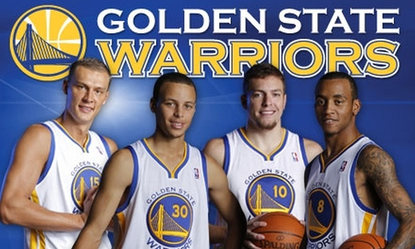
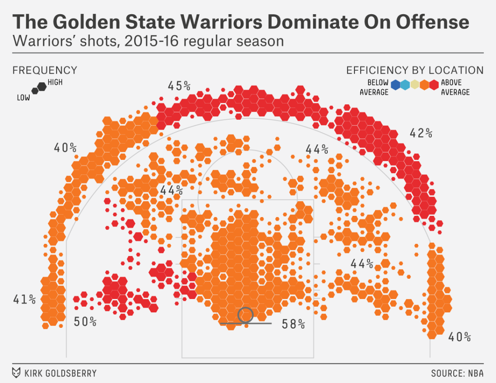
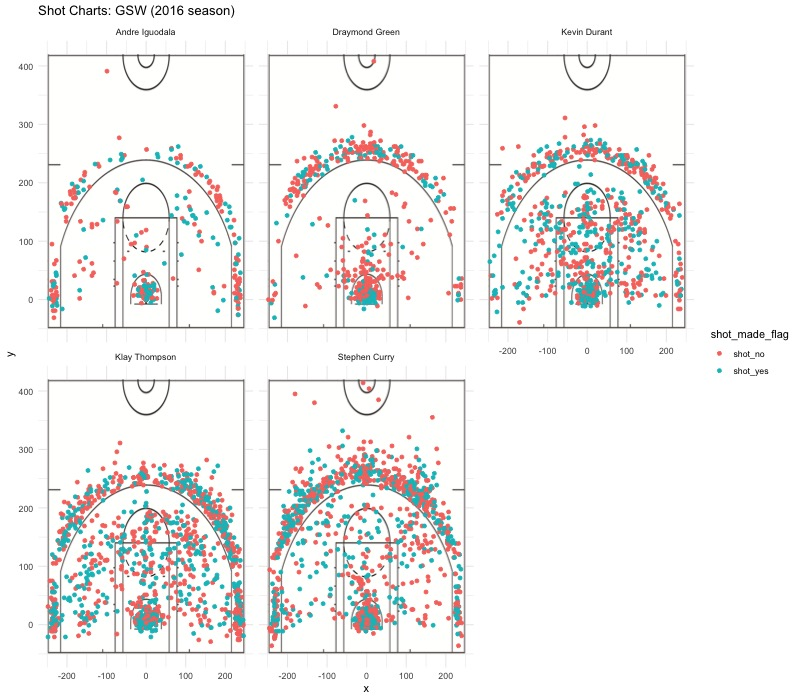
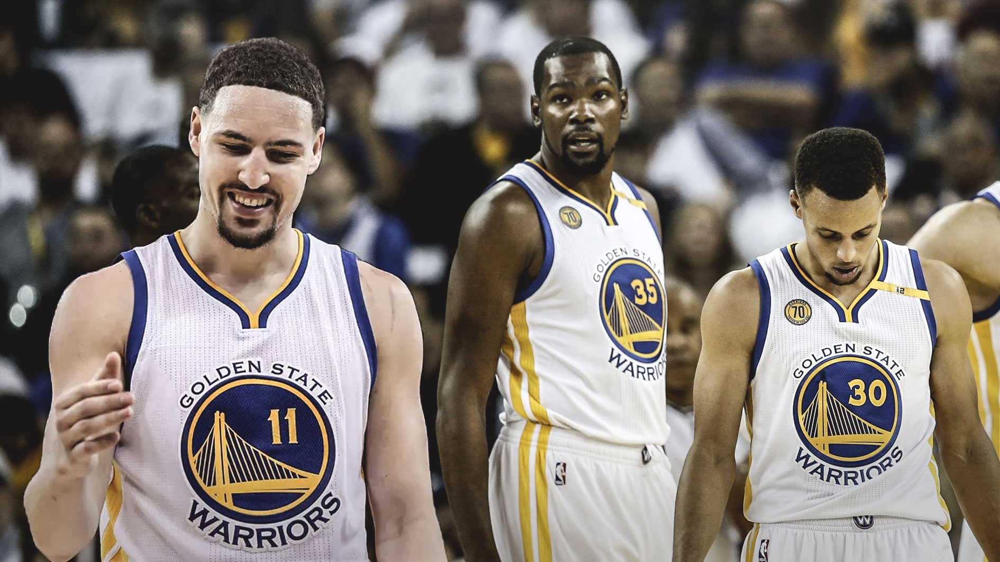

Workout 1
================
Kyle Golden

    ## 
    ## Attaching package: 'dplyr'

    ## The following objects are masked from 'package:stats':
    ## 
    ##     filter, lag

    ## The following objects are masked from 'package:base':
    ## 
    ##     intersect, setdiff, setequal, union

The Secret Formula to the Warrior's success?
============================================

 We all know that the Golden State Warriors are one of the hottest, if not the hottest team in the NBA right now, but have you ever asked yourself **how do they continue to win game after game**? What is their recipe for success? How do they continue to dominate the NBA leaderboards? Although such complex questions have very complex answers, one thing is for sure: The Golden State Warriors have some of the best shooters in the league. This report attempts the analyze why the Golden State Warriors are just so effective at offense, by using the shooting statistics of the five GSW starters: *Klay Thompson, Stephen Curry, Andre Iguodala, Kevin Durant and Draymond Green.*

### The Statistics

------------------------------------------------------------------------

##### Two-Point Shooting Statistics

If we take a look at the statistics for two point shots by the Golden State Warriors, we can see that the entire team, as a whole, is **very active** close to the basket and plays very aggresively on offense, a key aspect of their high scoring games.

Clearly, from the two point shooting statistics, we can see that the Andre Iguodala leads the team with with the highest percentage of his two-pointers made, however *he is also the least active two point shooter on the team*. If we take into account the amount of two pointers attempted, Kevin Durant seems to lead the Golden State Warriors close to the basket, with **390 two pointers scored** with Klay Thompson and Stephen Curry coming in a close second and third, respectively.

| Name           |  Two-Pointers Attempted|  Shots Made|  Percentage Made|
|:---------------|-----------------------:|-----------:|----------------:|
| Andre Iguodala |                     210|         134|        0.6380952|
| Kevin Durant   |                     643|         390|        0.6065319|
| Stephen Curry  |                     563|         304|        0.5399645|
| Klay Thompson  |                     640|         329|        0.5140625|
| Draymond Green |                     346|         171|        0.4942197|

##### Three-Point Shooting Statistics

Looking at the three pointer statistics for the Golden State Warriors it's clear that Klay Thompson and Stephen Curry are very active outside the three point line, leading their team in both number of three pointers made and the percentage of three pointers made. With their high three point shot taken to three point shot made percentage, both Thompson and Curry are some of the league leaders in three point shooting. It is also apparent that Andre Iguodala

| Name           |  Three-Pointers Attempted|  Shots Made|  Percentage Made|
|:---------------|-------------------------:|-----------:|----------------:|
| Klay Thompson  |                       580|         246|        0.4241379|
| Stephen Curry  |                       687|         280|        0.4075691|
| Kevin Durant   |                       272|         105|        0.3860294|
| Andre Iguodala |                       161|          58|        0.3602484|
| Draymond Green |                       232|          74|        0.3189655|

> ###### Taking a closer look at the Klay Thompson and Stephen Curry
>
> Although Klay Thompson is a Shooting Guard, the position that is supposed to attempt the most shots and Stephen Curry is the Point Guard, the position that is supposed to be the main passer, the Golden State Warriors play a form of positionless basketball, allowing a more free flowing offense. Because of this, Stephen Curry takes advantage of his unique dribbling ability to become an unstoppable, efficient shooting machine. Stephen Curry often skillfully dribbles the ball until he is able to create an opening to take a shot. Contrastingly, Klay Thompson is a spot up shooter, meaning that Klay often catches the ball and then immediately shoots. With the two of them combined, Klay is able to set up ready for a shot while Stephen uses his dribbling skills to spread out the defense, oftentimes passing to a wide open Klay Thompson if he is not able to set up a shot for himself. The two have proven time and time again over the years that they are two of the most feared players in the NBA and a duo to be reckoned with.

##### Overall Shooting Statistics

If we take a look at the overall shooting statistics of the Golden State Warrior's starters for the 2016 season, we can see that Thompson, Curry and Durant are the backbone of the the Warrior's great scoring machine. Combined, those three account for *79% of the Golden State Warrior's made baskets*. It's clear that these three players, when working together, prove to be an unstoppable offense for the Warriors.

| Name           |  Total Shots Attempted|  Shots Made|  Percentage Made|
|:---------------|----------------------:|-----------:|----------------:|
| Kevin Durant   |                    915|         495|        0.5409836|
| Andre Iguodala |                    371|         192|        0.5175202|
| Klay Thompson  |                   1220|         575|        0.4713115|
| Stephen Curry  |                   1250|         584|        0.4672000|
| Draymond Green |                    578|         245|        0.4238754|

> ###### The Warriors and their Offensive Dominance
>
>   As of today, the Warriors have the most efficient offense in all of the NBA, leading the league with 112 points scored per 100 posessions, especially beyond the three point arc. The Warriors have revolutionized offense in basketball and have proven the importance of shooting three pointers, averaging 12 three pointers per game, and scoring on average 37.5 points behind the three point line. The Warriors unique offensive style has not only proven to win games and dominate opponents, but has forced all of the NBA to reevaluate the value and skills of certain positions. [Source](https://fivethirtyeight.com/features/how-the-golden-state-warriors-are-breaking-the-nba/)

### Mapping Shots

------------------------------------------------------------------------

If we graph the locations of each shot taken by the starters of the Golden State Warriors, we can see some interesting trends in the shooting preferences of each player. For example, it is apparent that both Stephen Curry and Draymond Green prefer shooting either threes, or likely taking layups, while players like Klay Thompson and Kevin Durant tend to also shoot many normal two pointers. Also apparent from the image is that Andre Iguodala and Draymond Green take significantly less shots than the other three players of the Warriors, which follows closely to our observations in the above tables.

A plausible reason for the discrepency between the shooting locations of Stephen Curry and both Klay Thompson and Kevin Durant is Stephen Curry's ability to stretch the defense. With his ball handling skills and three point shooting ability, Stephen Curry is able to effectively move the ball away from the basket, drawing the defense toward the court's perimeter, freeing up the key for mid-range shooters such as Kevin Durant and Klay Thompson

### What Does it Mean?

------------------------------------------------------------------------

It's obvious from the data that all three, Stephen Curry, Klay Thompson and Kevin Durant are great shooters, but there are plenty of great shooters in the NBA; why do these three specifically create such a force to be reckoned with? These three players create such an unstoppable offense, not just because they are great shooters, but because they completely complement each other. Stephen Curry is able to quickly dribble the ball and has one of the fastest release times in the NBA, forcing the opponents to stretch themselves thin by following him closely, Kevin Durant uses his height of 7'1 to dominate the key as other players are unable to block him, and Klay Thompson opens himself, ready to shoot threes at any point in time. Alone, they are top players in their own respective areas, but together they form arguably the best offense in all of the NBA.
